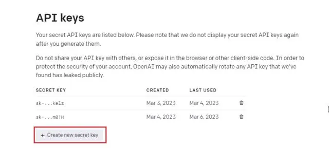
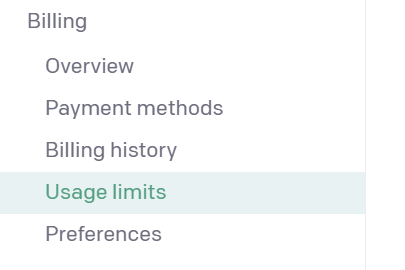
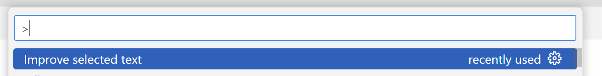
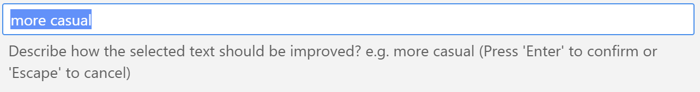

# AI Text Transformer (Preview)

 

A Visual Studio Code extension that sends the selected text to an AI (e.g. ChatGPT) for transformation.


:exclamation: Please bear in mind the following important notes

- **This extension is currently a preview app.**

- **The AI service may charge you for each transformation.**

- **All costs incurred by using this extension are the users own and not the responsibility of the developer.**

## Features

This very simple extension that passes any selected text in your document over to a chat AI along with instructions on how to improve it. You aren't limited in the ways you can improve the text, but some examples are making it:

- more casual
- more professional
- funnier


The extension works by making a remote call to an AI service such as Open AI's ChatGPT.

Currently only one AI service is supported, OpenAI's ChatGPT. ChatGPT requires a paid account and an API key in order to make remote calls.

> Important: Open AI charges for each call to it's API. You, the user, are responsible for all costs and charges.

The user must supply their own API key. The cost of each call will depend on the number of tokens used in the request. This is determined by the following factors:

- the length of the selected text,
- the length of the full prompt,
- and the length of the chat response.

## Installation

- You must have an Open AI account in order to use this extension. If you don't have an account head to [platform.openai.com/signup](platform.openai.com/signup) and create a free account. If you already have an OpenAI account, simply log in.
- Next, click on your profile in the top-right corner and select "View API keys" from the drop-down menu.
- Here, click on "Create new secret key" and copy the API key. You can’t copy or view the entire API key later on, so please store the API key safely and securely. Do not share or display the API key in public. It’s a private key meant only for access to your account.



- For extra security, we recommend setting spending limits on your OpenAI account in the Billing section [](https://platform.openai.com/account/billing/limits) of the OpenAI website.



- Open up Visual Studio Code and head to "File | Preferences | Settings"
- In the `Search settings` box, type `nurdledurdle`.
- Now paste the API Key in the `nurdlydurdle: Api Key` setting.
- Close the Visual Studio Code settings.

## Usage

- In Visual Studio Code, select some text you want to change.
- Press `Ctrl+Shift+P` to open the quick command palette.
- Start typing `Transform selected text (AI)` and press Enter.



- In the dialog box that appears, type the kind of change you'd like to make to the selected text.



- Press enter, and follow further onscreen instructions.

## Extension Settings

This extension contributes the following settings:

- `aitexttransformer.apiKey`: The API Key used to call the AI Service
- `aitexttransformer.defaultFullPrompt`: The full prompt that is filled in and sent to the AI service.
- `aitexttransformer.defaultTransform`: The default text that is displayed to the user when suggesting new text improvements.
- `aitexttransformer.aiService`: The AI service to use. The only option currently available is `openAI`.

## Further information

Behind the scenes, the extension is simply sending a prompt to an AI Chat service and pasting in the response.

```plaintext
Make the text following the --- more casual. 

Return only the revised text without the --- in your response and nothing else.

---

SELECTED TEXT
```

The full prompt is customizable using the `aitexttransformer.defaultFullPrompt` setting.

## Known Issues

Please report any issues to the Github page.

## Release Notes

Below are release notes

### 0.0.1

Initial beta release.

---

**Enjoy!**
